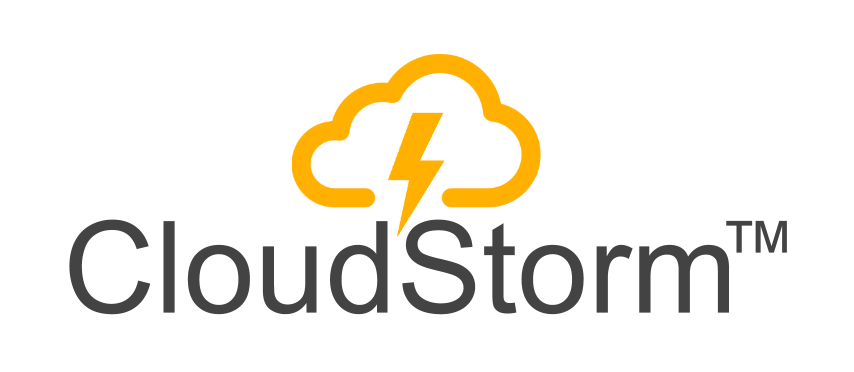

Welcome to CloudStorm - the open-source enterprise software framework for web developers.

:octocat: We are currently looking for contributors and beta testers :octocat:

## What is CloudStorm?
CloudStorm creates all administration and data manipulation screens and forms for any resource in a database.
The following are automatically generated for You:
* Index pages with in-place editing
* Resource creation forms
* Resource edit forms
* CloudStorm Wizards -> forms within forms to create related resources in-place

###See it in action on [Pluncker](https://embed.plnkr.co/JDwFkOLq1ZaKrEpOHZn1/)

###Check out another [Live Demo](http://demo.cloudstorm.io)
> Use credentials cloudstorm@example.com / cloudstorm or create new user.  
> (This is a rails app, see source [here](https://github.com/cloudstorm/cloudstorm-rails-examples/tree/master/todo-list).)

For documentation geared towards our automation and integration business, we recommend starting with the [CloudStorm website](http://cloudstorm.io).

### Philosophy
While CloudStorm is an opinionated framework, we always strive for easy and straightforward customization.
If you find otherwise, please file an [Issue](../../issues) without hesitation.
We're promoting the _Devagement_ principle: empowering _developers_ to be their own project _managers_ in corporate relationships.

## Resources
This is the main source of documentation for **developers** working with (or contributing to) the CloudStorm project.
* [Basic How-To](docs/basics.md)
* [Reference](docs/README.md)
* [Releases](../../releases)
* [Example Rails Apps](https://github.com/cloudstorm/rails-examples)

## Getting started
#### Installation
1. Install via Bower `bower install cloudstorm`
1. Require `cloudstorm/src/cloudstorm.js.coffee` in your app's main JS file
1. Require `cloudstorm/src/cloudstorm.css.scss` in your app's main CSS file
1. Inject `"cloudStorm"` as dependency in your Angular app
1. Enjoy! or read [the Basics](docs/basics.md)

#### Dependencies
* A JSON API serializer for the backend.
  _There are dozens of libraries to choose from, see the [Basic How-to](docs/basics.md) for more info._

## Bugs and Feedback
For bugs, questions and discussions please use [Github Issues](../../issues).

## License
See the [LICENSE](./LICENSE.txt) file.
